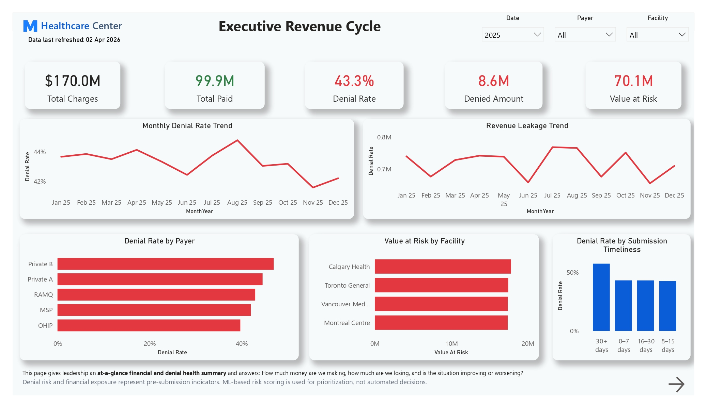
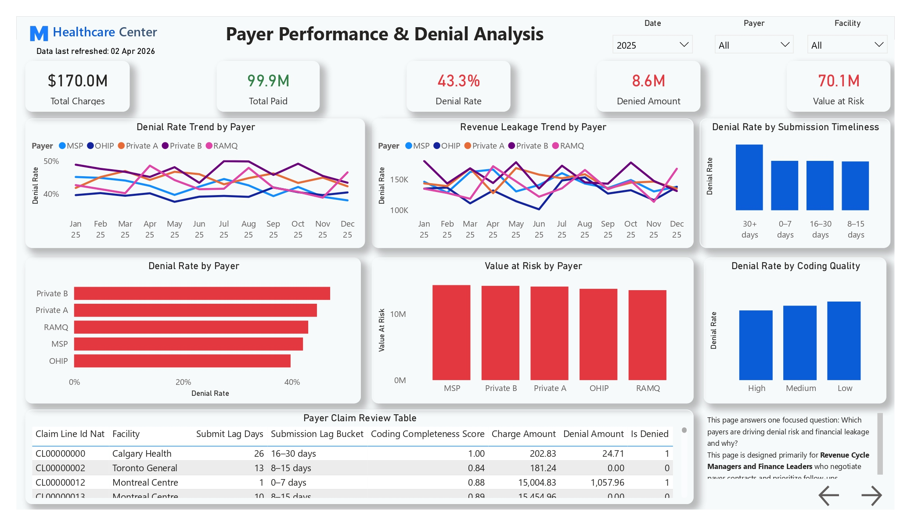
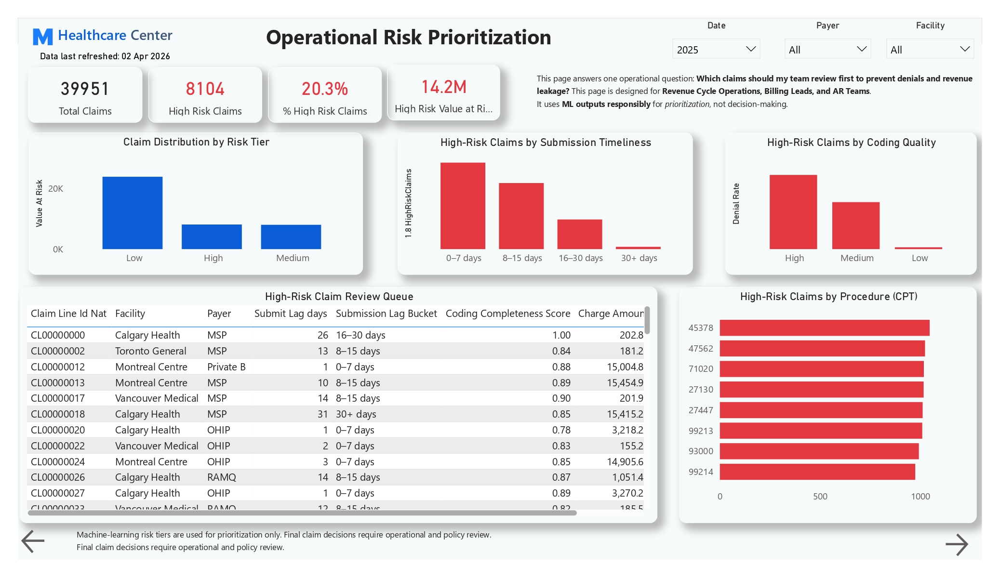

# Chronic-Disease-Diabetes-Longitudinal-Monitoring
Developed a multi page Power BI dashboard for diabetes management, enabling executives, clinicians, and providers to monitor population risk, identify high risk patients, analyze provider burden, and track individual patient disease progression for proactive chronic care.

**Role:** Lead Data Consultant & AI Architect  
**Domain:** Healthcare Analytics  
**Tools:** Power BI, SQL, Python, Azure Data Factory, Excel

## 🔗 View Live Demo

👉 **[View Power BI Dashboard](https://app.powerbi.com/)**  

## Key Outcomes & Impact
-	**Improved Risk Visibility:** High-risk patients identified early using longitudinal patterns
-	**Better Care Prioritization:** Clinicians can focus on patients with worsening trends or overdue monitoring
-	**Operational Insight:** Care gaps surfaced clearly, separating follow-up failures from clinical deterioration
-	**Provider Awareness:** Risk burden distributed transparently across provider panels
-	**Strategic Value:** Enables proactive chronic care strategies aligned with value-based care models
---
## 🛑 Business Problem
Healthcare organizations managing large diabetic populations often struggle with **fragmented clinical data, limited longitudinal visibility**, and **reactive care models**.
Leadership lacked a unified view to answer critical questions:
-	How many diabetic patients are currently at risk?
-	Are clinical outcomes improving over time?
-	Where are patients missing follow up care?
-	Which providers and patients require immediate attention?
Without integrated analytics, chronic disease management remained **inefficient, delayed, and costly**.
---
## Objective
Design an **end to end population health analytics solution** that enables:
-	Executive level visibility into diabetes risk and care gaps
-	Clinician level prioritization of high risk patients
-	Provider level performance analysis
-	Patient level longitudinal disease tracking
The goal was to support **proactive care**, improve outcomes, and reduce long term complications.
---
## ✔ Solution Overview
I developed a **multi layer Power BI analytics solution** that transforms raw clinical data into actionable insights across four perspectives:
1.	**Population (Executive Overview)**
2.	**Clinical Operations (High Risk Worklist)**
3.	**Provider Performance**
4.	**Patient Longitudinal Journey**
The solution integrates laboratory, encounter, and patient data into a clean analytical model designed for chronic disease monitoring.
---
## Analytics Architecture
-	**Data Ingestion:** Automated pipelines for clinical and operational data
-	**Data Modeling:** Patient-centric star schema with longitudinal fact tables
-	**Feature Engineering:** 
-	Risk stratification
-	Disease control classification
-	Trend detection
-	Care gap identification
-	**Visualization:** Interactive Power BI dashboards tailored to different healthcare stakeholders
  
---

## Dashboard Walkthrough
### 1. Executive Overview
**Population level diabetes risk overview**
This page provides leadership with a **30 second snapshot** of overall diabetes management performance.

**Key Insights**
-	Total diabetic population size
-	Percentage of high risk patients
-	Proportion of patients not at clinical goal
-	Active care gap rate
-	Long term HbA1c trend across the population
**Value**
-	Reveals hidden risk not visible in averages
-	Highlights systemic care gaps
-	Supports strategic planning and resource allocation

### 2. Clinical Worklist – High Risk Patients
**Identify patients requiring immediate intervention**
Designed for care managers and clinicians, this page focuses on **actionability**.
**Key Features**
-	High risk patient count and care gap indicators
-	Patient level table with: 
-	Latest HbA1c
-	Risk drivers
-	Trend classification
-	Care gap duration
-	Provider attribution

**Value**
-	Enables targeted outreach
-	Reduces reactive care
-	Supports weekly and daily care coordination workflows
---

### 3. Provider Performance & Risk Burden
**Provider level view of diabetes risk and care gaps**
This page evaluates how patient risk and care gaps are distributed across providers.
**Key Insights**
-	High-risk patient percentage by provider
-	Care gap prevalence by provider
-	Risk driver composition (clinical vs follow-up related)

**Value**
-	Identifies variation across provider panels
-	Supports quality improvement initiatives
-	Encourages system-level optimization rather than blame
---

### 4. Patient Longitudinal Journey
**Longitudinal view of individual patient disease progression**
This page allows clinicians to deep dive into an individual patient’s history.

**Key Features**
-	HbA1c timeline with clinical reference threshold
-	Care gap visualization (days since last test)
-	Encounter context (OP/IP visits)
-	Patient snapshot indicators
**Value**
-	Makes disease progression visible over time
-	Identifies missed monitoring opportunities
-	Supports personalized care discussions
---

## 📸 Dashboard Screenshots

### Executive Overview

### Clinical Worklist – High Risk Patients

### Provider Performance & Risk Burden 

### Patient Longitudinal Journey 

## Why This Solution Works
-	Patient centric design supports both population and individual care paths
-	Longitudinal analytics goes beyond snapshot reporting
-	Clear separation of executive, clinical, provider, and patient views
-	Clinically interpretable visuals aligned with real healthcare workflows
---

## Key Learnings
-	Population averages often hide individual deterioration
-	Care gaps are as critical as clinical measurements
-	Longitudinal monitoring is essential for chronic disease programs
-	Well-designed dashboards improve both decision-making and clinical trust
---

## Conclusion
This project demonstrates how **integrated healthcare analytics** can transform chronic disease management from reactive monitoring to **proactive, data-driven care**.
By aligning executive strategy, clinical operations, provider performance, and patient level insights, the solution enables better outcomes, improved efficiency, and long term cost reduction.

## End-to-End Architecture

    ┌──────────────────────────────┐
    │         Data Sources         │
    │    (EHR | Billing systems)   │
    └─────────────┬────────────────┘
                  ↓
    ┌──────────────────────────────┐
    │   Azure Data Factory (ETL)   │
    └─────────────┬────────────────┘
                  ↓
    ┌──────────────────────────────┐
    │   Azure SQL Data Warehouse   │
    └─────────────┬────────────────┘
                  ↓
    ┌──────────────────────────────┐
    │ Feature Engineering (Python) |
    │              &               |
    |             EDA              |
    └─────────────┬────────────────┘
                  ↓
    ┌──────────────────────────────┐
    │     Power BI Dashboards      │
    └──────────────────────────────┘

